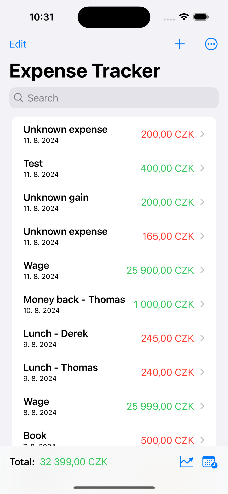
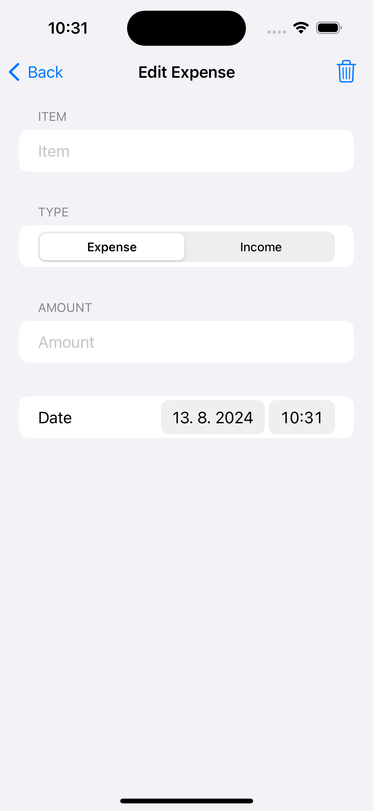
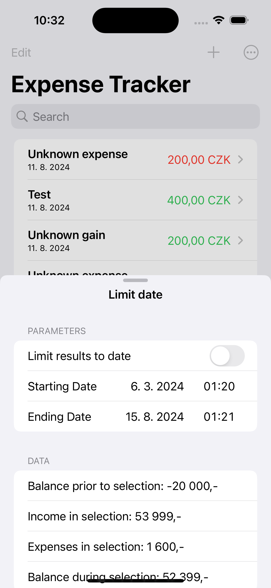
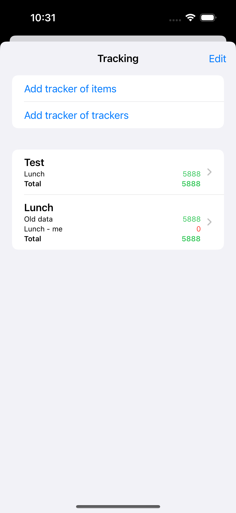
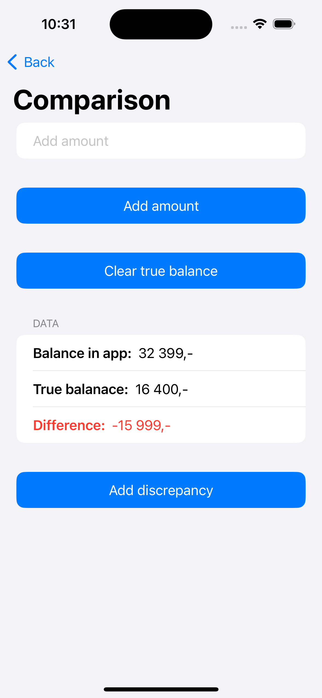
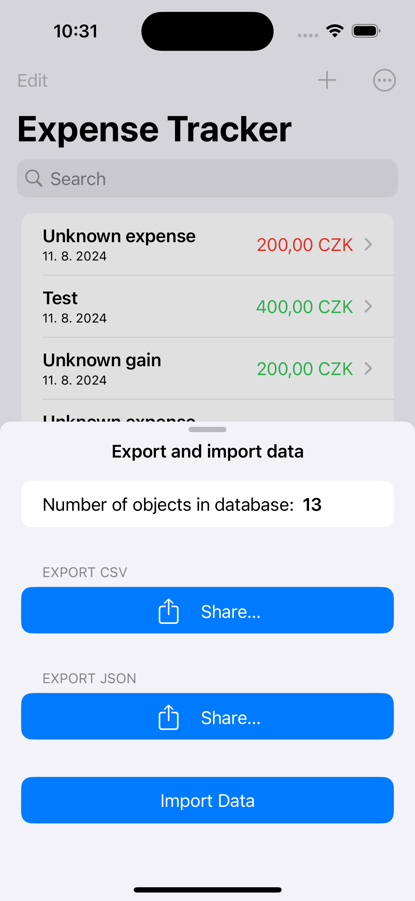

# Expense Tracker
This repository contains an iOS app for tracking personal finances. 

***Note:*** *This app was created purely as a way for me to learn SwiftUI and SwiftData. It can be useful, but it is simple and may be prone to bugs.*

It has the following functionality: 

- It allows the user to input their personal expenses and their income.
- It allows the user to search through those. 
- The user can also limit the search based on date. 
- The user can set up trackers that track certain expenses/income. 
- It allows the user to compare their true finances with the balance in the app. 
- The user can export and import their database freely as a CSV file or a JSON. 

This app is meant purely for Czech environment. The reason for this is that it uses integers for calculations because in Czechia the smallest amount anyone ever operates with is 1 Czech Crown. Values below that are so small that everyone just automatically rounds those numbers off. But it wouldn't work well with other currencies, like USD, GBP or Euro. 

A future version may be more open. 

  
                                                

                                     
                                     
                                     

